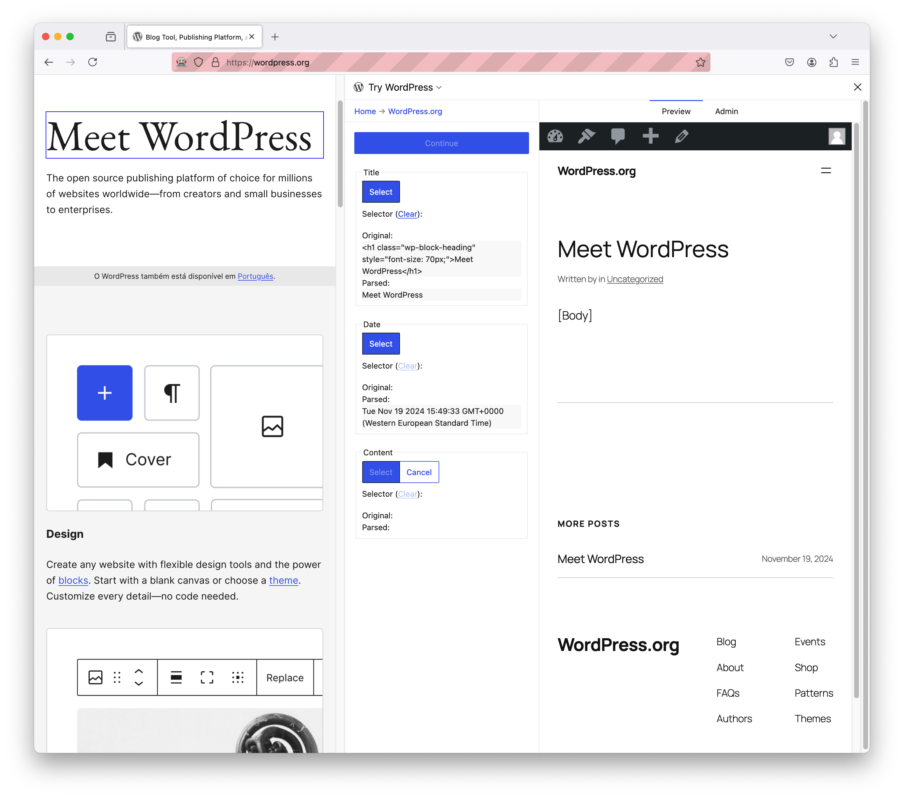

# Try WordPress
_Try WordPress_ allows you to **import your existing website to WordPress** in an intuitive way.

It's a browser extension that comes with a local WordPress site, and makes it easy for you to import content from your existing site. At the end, you can export the local site to its permanent location, at a WordPress host of your choosing.

## Installing
> This project is in _alpha_ state, not all features are fully implemented and it is likely not very useful yet.

Currently, the extension is not published to the browser extension stores, so you will not be able to install it directly from your browser. Instead, the easiest way to install the extension is by following the [development environment setup instructions](CONTRIBUTING.md).

## How to contribute
There are multiple ways you can contribute to this project:

- Submit improvements or fixes to the Try WordPress browser extension itself: see [`CONTRIBUTING.md`](CONTRIBUTING.md)
- Create or improve site definitions so that other users can more easily import their site: Coming soon.
- Create or improve transformation plugins so that content can better fit in the WordPress plugin ecosystem: Coming soon.
